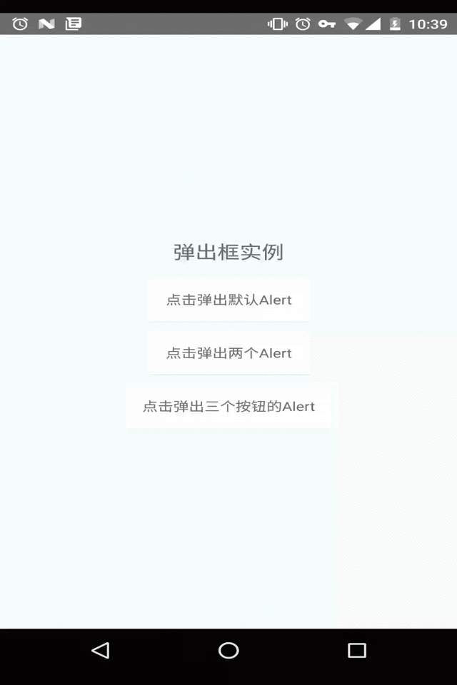

> # React Native API模块之Alert弹出框详解及使用

### 前言
类似于Android的Dialog,谈对话框

### 平台的差异性

| 平台     | 带输入框组件 | button   |方法|
| :------- | ----: | :---: |:---: |
| IOS | AlertIOS |  default,cancel,destructive    |static alert(...)|
| Android    | 无  |  neutral,negative,positive   |static alert(...)|

### 实例代码如下:

```JavaScript
'use strict';
import React, {Component} from 'react';
import {
    AppRegistry,
    StyleSheet,
    Text,
    View,
    Alert,
    ToastAndroid,
    TouchableHighlight
} from 'react-native';

class CustomButton extends Component {

    render() {

        return (<TouchableHighlight
            style={styles.button}
            underlayColor='#a5a5a5'
            onPress={this.props.onPress}>
            <Text style={styles.buttonText}>{this.props.text}</Text>
        </TouchableHighlight>);

    }

}

export default class AlertDemo extends Component {
    render() {
        return (
            <View style={styles.container}>
                <Text style={styles.welcome}>
                    弹出框实例
                </Text>
                <CustomButton text='点击弹出默认Alert'
                              onPress={()=>Alert.alert('温馨提醒','确定退出吗?')}
                />
                <CustomButton text="点击弹出两个Alert" onPress={() => Alert.alert("温馨提示", "确认退出?", [
                    {text: '取消', onPress: () => ToastAndroid.show('你点击了取消~', ToastAndroid.SHORT)},
                    {text: '确定', onPress: () => ToastAndroid.show('你点击了确定~', ToastAndroid.SHORT)}
                ])}/>
                <CustomButton text='点击弹出三个按钮的Alert'
                              onPress={() => Alert.alert('温馨提醒', '确定退出吗?', [
                                  {
                                      text: 'One',
                                      onPress: () => ToastAndroid.show('你点击了One~',
                                                                       ToastAndroid.SHORT)
                                  },
                                  {
                                      text: 'Two',
                                      onPress: () => ToastAndroid.show('你点击了Two~',
                                                                       ToastAndroid.SHORT)
                                  },
                                  {
                                      text: 'Three',
                                      onPress: () => ToastAndroid.show('你点击了Three~',
                                                                       ToastAndroid.SHORT)
                                  }
                              ])}
                />
            </View>
        );
    }
}

const styles = StyleSheet.create({
                                     container: {
                                         flex: 1,
                                         justifyContent: 'center',
                                         alignItems: 'center',
                                         backgroundColor: '#F5FCFF',
                                     },
                                     welcome: {
                                         fontSize: 20,
                                         textAlign: 'center',
                                         margin: 10,
                                     },
                                     instructions: {
                                         textAlign: 'center',
                                         color: '#333333',
                                         marginBottom: 5,
                                     },
                                     button: {
                                         margin: 5,
                                         backgroundColor: 'white',
                                         padding: 15,
                                         borderBottomWidth: StyleSheet.hairlineWidth,
                                         borderBottomColor: '#cdcdcd',
                                     }
                                 });

AppRegistry.registerComponent('AlertDemo', () => AlertDemo);
```

### 运行效果图:

