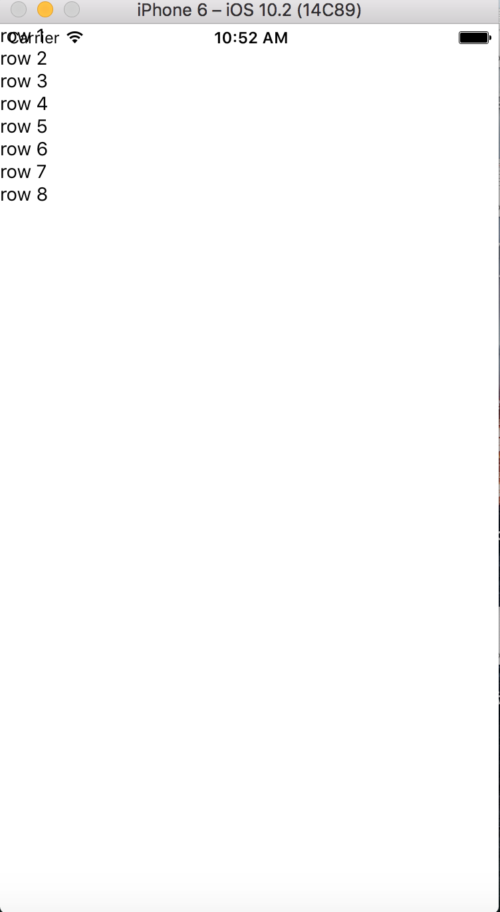
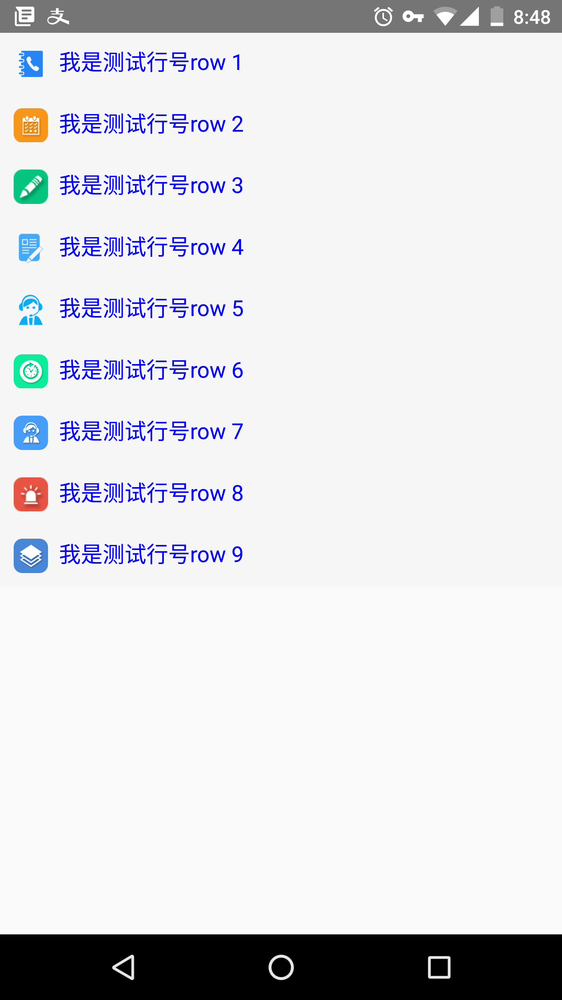
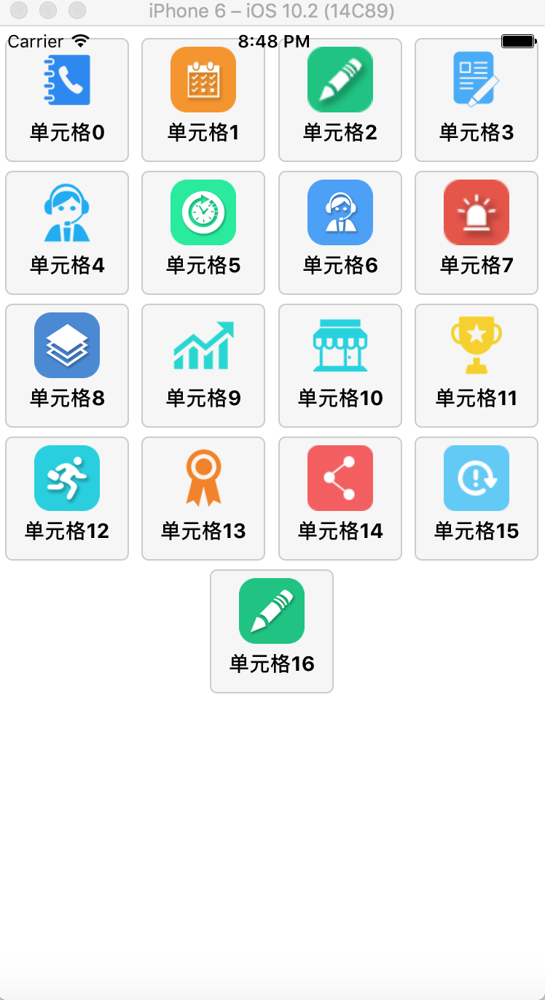

># React Native控件之ListView组件讲解以及详细实例

#### 前言

- 作用
    - 用来高效的展示垂直滚动的数据列表

- 使用三部曲

    - new一个ListView.DataSource对象
    - 给该对象传入一个简单的数据集合,使用数据源(data source)实例化一个ListView组件
    - 定义一个renderRow回调方法(该方法的参数是一个数组),renderRow方法会返回一个可渲染的组件(该就是列表的每一行的item)

> 废话不多说,下面看一个关于ListView最简单的官方实例吧

```JavaScript

/**
 * ListView的使用
 */
'use strict';
import React, {Component} from 'react';
import {
    AppRegistry,
    StyleSheet,
    Text,
    View,
    ListView,
} from 'react-native';

export default class ListViewDemo extends Component {

    // 构造
    constructor(props) {
        super(props);
        // 初始状态
        let dataSource = new ListView.DataSource({rowHasChanged: (r1, r2) => r1 !== r2});
        this.state = {

            ds: dataSource.cloneWithRows(
                ['row 1', 'row 2', 'row 3', 'row 4', 'row 5', 'row 6', 'row 7', 'row 8'])

        };
    }

    render() {
        return (
            <ListView dataSource={this.state.ds}
                      renderRow={(rowData) => <Text>{rowData}</Text>}
            />
        );
    }
}

const styles = StyleSheet.create({});

AppRegistry.registerComponent('ListViewDemo', () => ListViewDemo);

```

> 实例运行效果如下:


> ListView实现图文混排:

```JavaScript
/**
 * ListView的使用
 */
'use strict';
import React, {Component} from 'react';
import {
    AppRegistry,
    StyleSheet,
    Text,
    View,
    ListView,
    TouchableOpacity,
    Image
} from 'react-native';

const THUMB_URLS = [

    require('./images/bandaged.png'),
    require('./images/call.png'),
    require('./images/dislike.png'),
    require('./images/fist.png'),
    require('./images/flowers.png'),
    require('./images/like.png'),
    require('./images/party.png'),
    require('./images/poke.png'),
    require('./images/superlike.png'),
    require('./images/victory.png'),

];

export default class ListViewDemo extends Component {

    // 构造
    constructor(props) {
        super(props);
        // 初始状态
        let dataSource = new ListView.DataSource({rowHasChanged: (r1, r2) => r1 !== r2});

        this.state = {

            ds: dataSource.cloneWithRows(
                ['row 1', 'row 2', 'row 3', 'row 4', 'row 5', 'row 6', 'row 7', 'row 8', 'row 9',
                 'row 10'])

        };
    }


    _renderRow(rowData: string, sectionID: number, rowID: number) {

        let imgSrc = THUMB_URLS[rowID];

        return (

            <TouchableOpacity underlayColor="red">
                <View>
                    <View style={styles.row}>

                        <Image style={styles.thumb} source={imgSrc}/>

                        <Text style={styles.item}>{ "  我是测试行号"+rowData }</Text>

                    </View>
                </View>
            </TouchableOpacity>

        );

    }

    render() {
        return (
            <ListView dataSource={this.state.ds}
                      renderRow={this._renderRow}
            />
        );
    }

    _itemPress(text) {

        alert(text.rowData);

    }
}
const styles = StyleSheet.create({
                                     item: {

                                         flex: 1,
                                         fontSize: 16,
                                         color: 'blue',
                                         borderBottomColor: '#ddd',
                                     },

                                     row: {

                                         flexDirection: 'row',
                                         justifyContent: 'center',
                                         padding: 10,
                                         backgroundColor: '#F6F6F6',

                                     },

                                     thumb: {

                                         width: 25,
                                         height: 25,

                                     }
                                 });
AppRegistry.registerComponent('ListViewDemo', () => ListViewDemo);
```



> ListView实现图文横向排列:

```javaScript
/**
 * ListView实现图文横向排列
 */

'use strict';
import React, {Component} from 'react';
import {
    AppRegistry,
    StyleSheet,
    Text,
    View,
    ListView,
    TouchableOpacity,
    Image
} from 'react-native';

const THUMB_URLS = [

    require('./images/bandaged.png'),
    require('./images/call.png'),
    require('./images/dislike.png'),
    require('./images/fist.png'),
    require('./images/flowers.png'),
    require('./images/like.png'),
    require('./images/party.png'),
    require('./images/poke.png'),
    require('./images/superlike.png'),
    require('./images/zbjk@2x.png'),
    require('./images/yytxj@2x.png'),
    require('./images/yytkhpm@2x.png'),
    require('./images/wangdianzoufang@2x.png'),
    require('./images/rz@2x.png'),
    require('./images/share@3x.png'),
    require('./images/update@3x.png'),
    require('./images/kaoshi@3x.png'),


];

export default class ListViewDemo extends Component {

    // 构造
    constructor(props) {
        super(props);
        // 初始状态
        let dataSource = new ListView.DataSource({rowHasChanged: (r1, r2) => r1 !== r2});
        this.state = {

            ds: dataSource.cloneWithRows(
                this.genRows())

        };
    }

    genRows() {

        let dataBlob = [];
        for (let i = 0; i < THUMB_URLS.length; i++) {

            let pressText = '单元格' + i;
            dataBlob.push(pressText);

        }

        return dataBlob;

    }

    _renderRow(rowData: string, sectionID: number, rowID: number) {

        let imgSrc = THUMB_URLS[rowID];

        return (<TouchableOpacity underlayColor='red'>

            <View>
                <View style={styles.row}>

                    <Image style={styles.thumb} source={imgSrc}/>
                    <Text style={styles.text}>{rowData}</Text>

                </View>
            </View>

        </TouchableOpacity>);

    }

    render() {
        return (
            <ListView dataSource={this.state.ds}
                      initialListSize={12}
                      contentContainerStyle={styles.list}
                      renderRow={this._renderRow}
            />
        );
    }
}

const styles = StyleSheet.create({

                                     list: {
                                         marginTop: 5,
                                         justifyContent: 'space-around',
                                         flexWrap: 'wrap',
                                         flexDirection: 'row',
                                     },
                                     row: {
                                         justifyContent: 'center',
                                         padding: 5,
                                         margin: 3,
                                         width: 85,
                                         height: 85,
                                         backgroundColor: '#F6F6F6',
                                         alignItems: 'center',
                                         borderWidth: 1,
                                         borderRadius: 5,
                                         borderColor: '#ccc'
                                     },
                                     thumb: {
                                         width: 45,
                                         height: 45,
                                     },
                                     text: {
                                         flex: 1,
                                         marginTop: 5,
                                         fontWeight: 'bold',
                                     }
                                 });

AppRegistry.registerComponent('ListViewDemo', () => ListViewDemo);

```




> #### 属性与方法

| 属性     | 类型 | 作用   |
| :------- | ----: | :---: |
| dataSource | ListViewDataSource |  设置ListView的数据源    |
| initialListSize    | number  |  确定首屏,首页加载的数量  |
| onEndReachedThreshold     | number   |  当偏移量达到设置的临界值调用onEndReached  |
| pageSize     | number   |  每一次事件的循环渲染的行数  |
| removeClippedSubviews     | bool   |  使用前,给每一行(row)的布局添加over:'hidden'样式  |
| scrollRenderAheadDistance     | number   |  设置当该行进入屏幕多少像素以内之后就开始渲染该行  |

---

| 方法     | 参数 | 作用   |
| :------- | ----: | :---: |
| onChangeVisibleRows | (visibleRows,changedRows) |  当可见的行发生变化的时候回调该方法    |
| onEndReached    | void  |  一直滚动到距离底部onEndReachedThredshold设置的值进行回调该方法  |
| renderFooter     | ()=>renderable   |  每一次渲染过程中Footer(尾)该会一直在列表的底部  |
| renderHeader     | void   |  和上面的renderFooter差不多  |
| renderRow     | (rowData,sectionID,rowID,highlightRow)=>renderable    |  (数据源中一条数据,分组的ID,行的ID,标记是否是高亮选中的状态信息)   |
| renderScrollComponent     | (props)=>renderable   |  默认该会返回一个ScrollView  |
| renderSectionHeader     |  (sectionData,sectionID)=>renderable   |  为每一个section渲染一个粘性的header视图  |
| renderSeparator     |   (sectionID,rowID,adjacentRowHighlighted)=>renderable   |  设置分割线  |