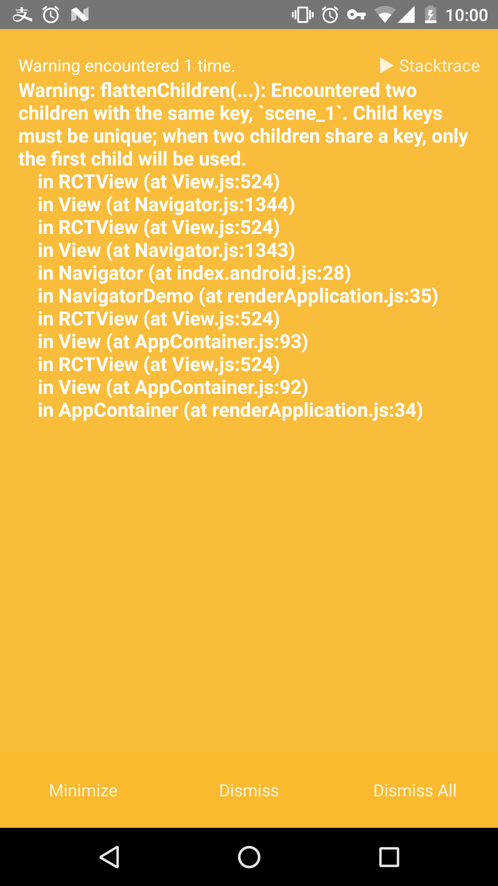
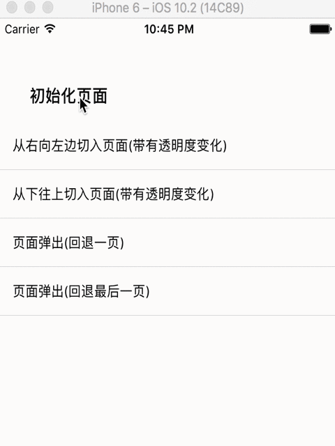

> # React Native控件之Navigator组件详解以及实例

### 前言
- 导航组件Navigator可以让我们客户端在不同的页面见进行切换
 - 提供了路由对象功能进行区分识别每一个页面
   - 通过renderScene方法，Navaigator根据指定的路由进行渲染指定的界面

> 动画手势的一些属性

动画手势属性     |
-------- |
PushFromRight |
FloatFromRight    |
FloatFromLeft     |
FloatFromBottom     |
FloatFromBottomAndroid     |
FadeAndroid     |
HorizontalSwipeJump     |
HorizontalSwipeJumpFromRight     |
VerticalUpSwipeJump     |
VerticalDownSwipeJump     |


> 导航器方法

方法     | 作用
-------- | ---
getCurrentRoutes | 返回存在的路由列表信息
jumpBack    | 进行回退操作,不会删除当前页面
jumpForward     | 进行跳转到当前页面的下一个页面
jumpTo(route)     | 根据传入的一个路由信息，跳转到一个指定的页面(页面不会被删除)
push(route)     | 导航切换到一个新的页面中，新的页面进行压入栈。通过jumpForward()方法可以回退过去
pop()      | 当前页面弹出来，跳转到栈中下一个页面，并且卸载删除掉当前的页面
replace(route)      | 只用传入的路由的指定页面进行替换掉当前的页面
replaceAtIndex(route,index)       | 传入路由以及位置索引，使用该路由指定的页面跳转到指定位置的页面
replacePrevious(route)       | 传入路由，通过指定路由的页面替换掉前一个页面
resetTo(route)         | 进行导航到新的界面，并且重置整个路由栈
immediatelyResetRouteStack(routeStack)        | 该通过一个路由页面数组来进行重置路由栈
resetTo(route)         | 进行导航到新的界面，并且重置整个路由栈
popToRoute(route)         | 进行弹出相关页面，跳转到指定路由的页面，弹出来的页面会被卸载删除
popToTop()        | 进行弹出页面，导航到栈中的第一个页面，弹出来的所有页面会被卸载删除

> 导航器属性风格

方法     | 作用
-------- | ---
getCurrentRoutes | 返回存在的路由列表信息
jumpBack    | 进行回退操作,不会删除当前页面
jumpForward     | 进行跳转到当前页面的下一个页面
jumpTo(route)     | 根据传入的一个路由信息，跳转到一个指定的页面(页面不会被删除)
push(route)     | 导航切换到一个新的页面中，新的页面进行压入栈。通过jumpForward()方法可以回退过去
pop()      | 当前页面弹出来，跳转到栈中下一个页面，并且卸载删除掉当前的页面
replace(route)      | 只用传入的路由的指定页面进行替换掉当前的页面
replaceAtIndex(route,index)       | 传入路由以及位置索引，使用该路由指定的页面跳转到指定位置的页面
replacePrevious(route)       | 传入路由，通过指定路由的页面替换掉前一个页面
resetTo(route)         | 进行导航到新的界面，并且重置整个路由栈
immediatelyResetRouteStack(routeStack)        | 该通过一个路由页面数组来进行重置路由栈
resetTo(route)         | 进行导航到新的界面，并且重置整个路由栈
popToRoute(route)         | 进行弹出相关页面，跳转到指定路由的页面，弹出来的页面会被卸载删除
popToTop()        | 进行弹出页面，导航到栈中的第一个页面，弹出来的所有页面会被卸载删除

> 导航器属性风格

方法     | 作用
-------- | ---
configureScene | 为可选的方法进行配置页面切换动画和手势
navigationContext.addListener('didfocus',callback)    | 每次页面切换完成或者初始化之后进行调用该方法
renderScene     | 渲染每一个路由指定的页面。参数为路由以及导航器对象两个参数

属性     | 类型|作用|
| :------- | ----: | :---: |
initialRoute | object|路由是标识导航器渲染标识每一个页面的对象|
navigationBar   | node|在页面切换中用来提供一个导航栏|
navigator     | object|可以从父类导航器中获取导航器对象|
sceneStyle     | View|置用于每个页面容器的风格|

> ###### 遇到的警告⚠ 希望有好心人帮忙解决一下




```javaScript

import React, {Component} from 'react';
import {
    AppRegistry,
    StyleSheet,
    Text,
    View,
    Navigator,
    TouchableOpacity,
} from 'react-native';


class NavButton extends Component {


    render() {

        return (<TouchableOpacity style={styles.button}
                                  underlayColor='#E42327'
                                  onPress={this.props.onPress}>
            <Text style={styles.buttonText}>{this.props.text}</Text>
        </TouchableOpacity>);

    }

}

class NavMenu extends Component {


    render() {

        return (
            <View style={styles.scenes}>
                <Text style={styles.msgText}> {this.props.message}</Text>
                <NavButton onPress={() => {

                    this.props.navigator.push({
                                                  message: '向右拖拽关闭开关',
                                                  sceneConfig: Navigator.SceneConfigs.FloatFromRight,
                                              });

                }}
                           text="从右向左边切入页面(带有透明度变化)"
                />
                <NavButton onPress={() => {

                    this.props.navigator.push({
                                                  message: '向下拖拽关闭开关',
                                                  sceneConfig: Navigator.SceneConfigs.FloatFromBottom,
                                              });

                }}
                           text="从下往上切入页面(带有透明度变化)"
                />
                <NavButton onPress={() => {

                    this.props.navigator.pop();

                }}
                           text="页面弹出(回退一页)"
                />
                <NavButton onPress={() => {

                    this.props.navigator.popToTop();

                }}
                           text="页面弹出(回退最后一页)"
                />


            </View>);

    }

}

class NavigatorDemo extends Component {


    render() {

        return (
            <Navigator
                style={styles.container}
                initialRoute={{message: '初始化页面',}}
                renderScene={(route, navigator) =>

                    <NavMenu message={route.message}
                             navigator={navigator}
                    />}

                configureScene={(route) => {

                    if (route.sceneConfig) {

                        return route.sceneConfig;

                    }

                    return Navigator.SceneConfigs.FloatFromBottom;
                    }
                }

            />
         );

    }
}

const styles = StyleSheet.create({
                                     container: {
                                         flex: 1
                                     },
                                     button: {
                                         backgroundColor: 'white',
                                         padding: 15,
                                         borderBottomWidth: StyleSheet.hairlineWidth,
                                         borderBottomColor: '#CDCDCD',
                                     },

                                     msgText: {
                                         fontSize: 17,
                                         fontWeight: '500',
                                         padding: 15,
                                         marginTop: 50,
                                         marginLeft: 15,
                                     }

                                 });

AppRegistry.registerComponent('NavigatorDemo', () => NavigatorDemo);

```

>  Demo演示

