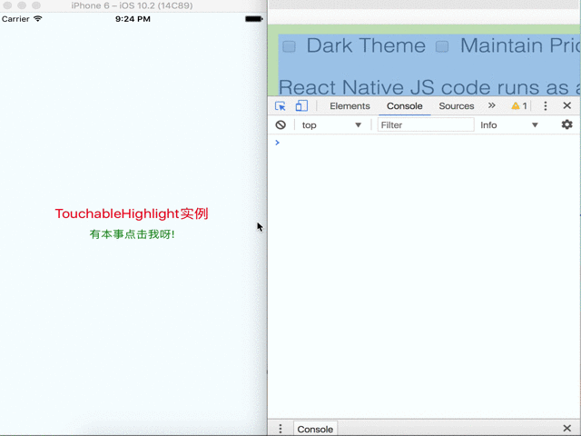
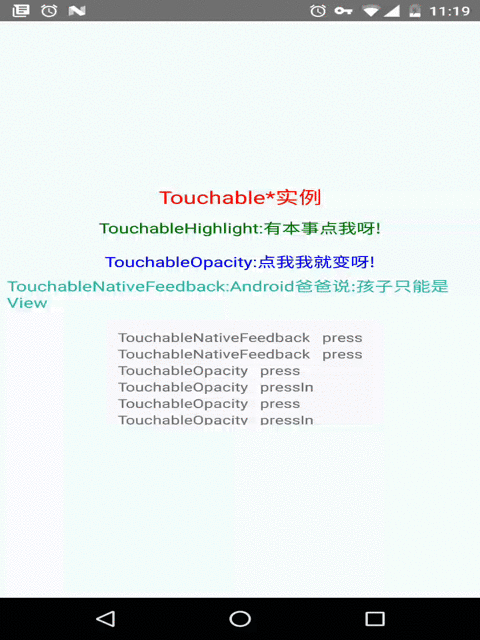

> # React Native控件之Touchable*系列组件详解

### Touchable*系列组件

| 组件     | 注意 | Qty   |
| :------- | ----: | :---: |
| TouchableHighlight | 带反馈效果,只支持一个字节点,需要设置多个子视图组件，那么就需要使用View节点进行包装 |  触摸点击高亮效果    |
| TouchableNativeFeedback    | 带反馈效果 ,孩子只能是view  |  Android使用   |
| TouchableOpacity     | 带反馈效果   |  透明度变化  |
| TouchableWithoutFeedback     | 触摸点击不带反馈效果,只支持一个字节点,需要设置多个子视图组件，那么就需要使用View节点进行包装    |  /  |

TouchableHighlight组件



``` javascript
import React, {Component} from 'react';
import {
    AppRegistry,
    StyleSheet,
    Text,
    View,
    TouchableHighlight
} from 'react-native';

export default class TouchableHighlightDemo extends Component {
    render() {
        return (
            <View style={styles.container}>
                <Text style={styles.textTitle}>
                    TouchableHighlight实例
                </Text>
                <TouchableHighlight
                    style={styles.touchable}
                    activeOpacity={0.5}
                    underlayColor='rgb(210,230,255)'
                    onPress={this.onPress}
                    onHideUnderlay={this.onHideUnderlay}
                    onShowUnderlay={this.onShowUnderlay}
                >

                    <Text style={styles.text}>有本事点击我呀!</Text>
                </TouchableHighlight>
            </View>
        );
    }

    onPress(){


        console.log('onPress is call!');

    }

    onHideUnderlay(){

        console.log('onHideUnderlay is call!');

    }

    onShowUnderlay(){

        console.log('onShowUnderlay is call!');

    }
}

const styles = StyleSheet.create({
                                     container: {
                                         flex: 1,
                                         justifyContent: 'center',
                                         alignItems: 'center',
                                         backgroundColor: '#F5FCFF',
                                     },
                                     text: {
                                         fontSize: 16,
                                         color:'green'
                                     },
                                     textTitle: {
                                         fontSize: 20,
                                         color:'red'
                                     },
                                     touchable: {
                                         borderRadius: 8,
                                         padding: 6,
                                         marginTop: 5,
                                     },
                                 });

AppRegistry.registerComponent('TouchableHighlightDemo', () => TouchableHighlightDemo);

```

---

> ###### 在Android平台上模拟三个组件



``` javascript
import React, {Component} from 'react';
import {
    AppRegistry,
    StyleSheet,
    Text,
    View,
    TouchableHighlight,
    TouchableOpacity,
    TouchableNativeFeedback
} from 'react-native';

export default class TouchableHighlightDemo extends Component {

    // 构造
    constructor(props) {
        super(props);
        // 初始状态
        this.state = {
            eventLog: [],
        };
    }

    render() {
        return (
            <View style={styles.container}>
                <Text style={styles.textTitle}>
                    Touchable*实例
                </Text>
                <TouchableHighlight
                    style={styles.touchable}
                    activeOpacity={0.5}
                    underlayColor='rgb(210,230,255)'
                    onHideUnderlay={ () => this._appendEvent('TouchableHighlight   hideUnderlay')}
                    onShowUnderlay={ () => this._appendEvent('TouchableHighlight   showUnderlay')}
                    onPress={() => this._appendEvent('TouchableHighlight   press')}
                >

                    <Text style={styles.textHighlight}>TouchableHighlight:有本事点我呀!</Text>
                </TouchableHighlight>

                <TouchableOpacity
                    style={styles.touchable}
                    onPressIn={ () => this._appendEvent('TouchableOpacity   pressIn')}
                    onPress={() => this._appendEvent('TouchableOpacity   press')}
                    onPressOut={() => this._appendEvent('TouchableOpacity   pressOut')}
                    onLongPress={() => this._appendEvent('TouchableOpacity   longPress')}
                >
                    <Text style={styles.textOpacity}>TouchableOpacity:点我我就变呀!</Text>
                </TouchableOpacity>

                <TouchableNativeFeedback style={styles.touchable}
                                         background={TouchableNativeFeedback.SelectableBackground()}
                                         onPress={() => this._appendEvent(
                                             'TouchableNativeFeedback   press')}
                >

                    <View style={styles.nativeFeedbackView}>
                        <Text
                            style={styles.textNativeFeedback}>TouchableNativeFeedback:Android爸爸说:孩子只能是View</Text>
                    </View>

                </TouchableNativeFeedback>

                <View style={styles.eventLogBox}>
                    {this.state.eventLog.map((e, ii) => <Text key={ii}>{e}</Text>)}
                </View>

            </View>
        );
    }

    _appendEvent(eventName) {
        let limit = 6;
        let eventLog = this.state.eventLog.slice(0, limit - 1);
        eventLog.unshift(eventName);
        this.setState({eventLog});
    }
}

const styles = StyleSheet.create({
                                     container: {
                                         flex: 1,
                                         justifyContent: 'center',
                                         alignItems: 'center',
                                         backgroundColor: '#F5FCFF',
                                     },
                                     textHighlight: {
                                         fontSize: 16,
                                         color: 'green'
                                     },
                                     textOpacity: {
                                         fontSize: 16,
                                         color: 'blue'
                                     },
                                     nativeFeedbackView: {

                                         width: 400,
                                         height: 40,


                                     },
                                     textNativeFeedback: {
                                         fontSize: 16,
                                         color: '#35C0A2'
                                     },
                                     textTitle: {
                                         fontSize: 20,
                                         color: 'red'
                                     },
                                     touchable: {
                                         borderRadius: 8,
                                         padding: 6,
                                         marginTop: 5,
                                     },
                                     eventLogBox: {

                                         padding: 10,
                                         margin: 10,
                                         height: 120,
                                         borderWidth: StyleSheet.hairlineWidth,
                                         borderColor: '#f0f0f0',
                                         backgroundColor: '#f9f9f9',

                                     }
                                 });

AppRegistry.registerComponent('TouchableHighlightDemo', () => TouchableHighlightDemo);

```


| Method     | eff | 支持组件 |
| :------- | ----: |----: |
| onPressIn | 用户开始触摸组件回调方法 | TouchableWithoutFeedback|
| onPressOut    | 用户完成触摸组件之后回调方法   |TouchableWithoutFeedback|
| onLongPress     | 当用户长时间按压组件(长按效果)的时候调用该方法    |TouchableWithoutFeedback|
| onLayout     | 当组件加载或者改组件的布局发生变化的时候调用 调用传入的参数为{nativeEvent:{layout:{x,y,width,height}}}   |TouchableWithoutFeedback|
| onPress     | 当用户点击的时候调用(触摸结束)。 但是如果事件被取消了就不会调用。(例如:当前被滑动事件所替代)  |TouchableWithoutFeedback|
| onHideUnderlay     | 当底层被隐藏的时候调用  |TouchableHighlight|
| onShowUnderlay     | 当底层显示的时候调用  |TouchableHighlight|

---

| property     | type | eff   |支持组件 |
| :------- | ----: | :---: |----: |
| accessibilityComponentType | View.AccessibilityComponentType |  设置可访问的组件类型    |TouchableHighlight, TouchableWithoutFeedback|
| accessibilityTraits    | View.AccessibilityTraits,[View.AccessibilityTraits]    |  设置访问特征   |TouchableHighlight,TouchableWithoutFeedback|
| delayLongPress     | number    |  设置延迟的时间，单位为毫秒。从onPressIn方法开始，到onLongPress被调用这一段时间  |TouchableHighlight,TouchableWithoutFeedback|
| delayPressIn     | number    |  设置延迟的时间，单位为毫秒，从用户触摸控件开始到onPressIn被调用这一段时间  |TouchableHighlight,TouchableWithoutFeedback|
| pressRetentionOffset     | {top:number,left:number,bottom:number,right:number}     |  该设置当视图滚动禁用的情况下，可以定义当手指距离组件的距离。当大于该距离该组件会失去响应。当少于该距离的时候，该组件会重新进行响应。  |TouchableHighlight,TouchableWithoutFeedback|
| accessible     | bool  |  设置当前组件是否可以访问  |TouchableWithoutFeedback,TouchableHighlight|
| activeOpacity     | number  |  该用来设置视图在进行触摸的时候，要要显示的不透明度(通常在0-1之间)  |TouchableHighlight|
| underlayColor     | RGB  |  当触摸或者点击控件的时候显示出的颜色  |TouchableHighlight|
| style     | {}  |  可以设置控件的风格演示，该风格演示可以参考View组件的style  |TouchableHighlight|
| TouchableNativeFeedback.SelectableBackground()     | / |  使用android默认主题背景  |TouchableNativeFeedback|
| TouchableNativeFeedback.SelectableBackgroundBorderless()       | /  |  使用android默认的无框的主题背景  |TouchableNativeFeedback|
| TouchableNativeFeedback.Ripple(color,borderless)        | /  |  当组件被按下的时候有一个水滴的效果.通过color参数指定颜色，如果borderless为true的时候，那么该水滴效果会渲染到该组件视图的外边。同样该背景类型参数也需要Android API 21+才可以使用  |TouchableNativeFeedback|

#### 参考文档

[江清清](http://leanote.leanote.com)